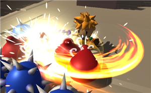
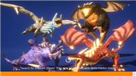
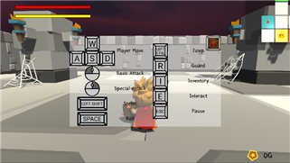
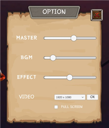
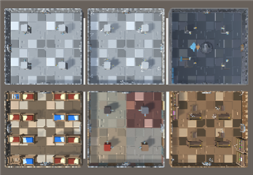
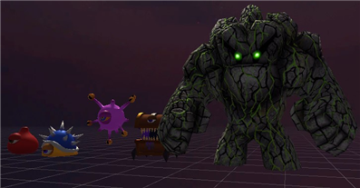
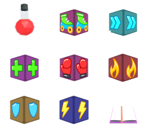
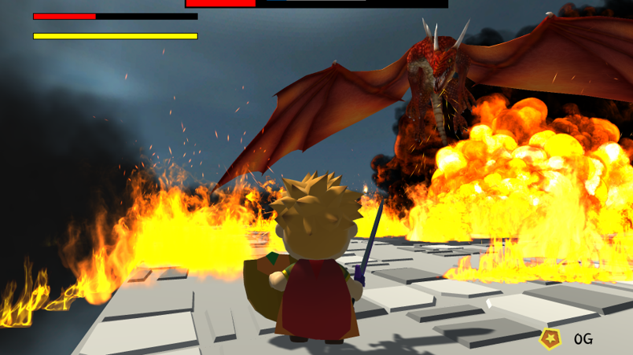

# Dragon Slayer
3D 액션 로그라이크 게임

## 🖥️ 프로젝트 소개
Unity Asset Store의 무료 애셋을 활용하여 Issac을 모방하여 만든 게임입니다.
<br>
<a href="https://github.com/kimjh7204/SW-Bootcamp-TEAM1">본 프로젝트 링크로 이동</a>

## 🕰️ 개발 기간
* 23.07.26일 - 23.08.24일

### 🧑‍🤝‍🧑 맴버구성
 - 팀장  : 차정민 - 플레이어, 보스 캐릭터, 아이템 기능 구현
 - 팀원1 : 김준영 - UI/UX, 로딩 화면, 인벤토리 시스템 구현
 - 팀원2 : 김태영 - 절차적 생성 던전 맵, 포탈 및 스테이지, 특수방 기능 구현
 - 팀원3 : 조상호 - Enemy AI, GameManager, Mini Map 구현

### ⚙️ 개발 환경
- **IDE** : Visual Studio 2022, JetBrains Rider
- **Game Engine** : Unity 2022.3.4f1
- **Git GUI Tool** : GitKraken

## 📌 주요 기능
#### 플레이어 캐릭터

- 3인칭 시점 Cinemachine Virtual Camera
- 달리기 및 이동, 구르기, 점프
- 콤보 공격, 패링

#### 로딩 화면

- 비동기적 로드

#### UI/UX


- 볼륨 조절, 해상도, 전체화면 on/off
- 조작법 가이드
- 미니맵
- 일시정지 메뉴
- 인벤토리 시스템

#### 던전 맵

- 절차적 지형 생성 알고리즘에 기반한 랜덤 맵 생성
- 다양한 테마의 Room(황금방, 상점방, 보스방 등)

#### Enemy AI

- NavMesh Agent를 활용한 자동 경로 탐색
- State에 따라 다양한 행동 및 전이

#### Item

- 3가지 등급(Common, Rare, Epic)
- 가중지 확률 적용
- 체력 회복, 공격력 강화, 번개 소환 등 다양한 아이템 구현

#### Boss

- 8가지의 일반 패턴(깨물기, 돌진, 화염 방사 등)
- 일정 체력 소진시 강력한 화염 공격


## Acknowledgement
```
 "본 연구는 과학기술정보통신부 및 정보통신기획평가원의 SW전문인재양성사업의 연구결과로 수행되었음"(2022-0-01127) 
```
